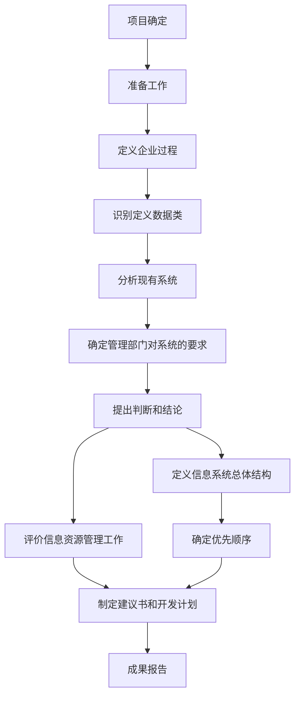

#### 1.信息安全

**1.设备安全：**

> 信息系统设备的安全是信息系统安全的首要问题。主要包括是三个方面：
>
> > 1.1 设备的稳定性：设备在一定时间内不出故障的概率。
> >
> > 1.2 设备的可靠性：设备在一定时间内正常执行任务的概率。
> >
> > 1.3 设备的可用性：设备随时可以正常使用的概率。

**2.数据安全：**

> 其安全属性包括秘密性、完整性和可用性。
>
> 即使信息系统没有受到损坏，但是其数据安全也可能已经受到了危害，如数据泄露、数据篡改等。

**3.内容安全：**

> 内容安全是信息安全在政治、法律、道德层次上的要求。
>
> > 3.1 信息内容在政治上是健康的。
> >
> > 3.2 信息内容符合国家的法律法规。
> >
> > 3.3 信息内容符合中华民族优良的道德规范。

**4.行为安全：**

> 数据安全本质上是一种静态的安全，而行为安全是一种动态安全。
>
> > 4.1 行为的秘密性： 行为的过程和结果不能危害数据的秘密性。必要时，行为的过程和结果也应该是秘密的。
> >
> > 4.2 行为的完整性：行为的过程和结果不能危害数据的完整性，行为的过程和结果是预期的。
> >
> > 4.3 行为的可控性：当行为的过程出现偏离预期是，能够发现、控制或纠正。
>
> **行为安全强调的是过程安全，体现在组成信息系统的硬件设备、软件设备和应用系统协调工作的程序(执行序列)符合系统设计的预期，这样才能保证信息系统的"安全可控"**

#### 2.信息安全等级保护

> * 第一级：信息系统受到破坏后，会对公民、法人和其他组织的合法权益造成损害，但不损害国家安全、社会秩序和公共利益。
> * 第二级：信息系统受到破坏后，会对公民、法人和其他组织的合法权益造成严重损害，或者对社会秩序和公共利益造成损害，但不损害国家安全。
> * 第三级：信息系统受到破坏后，会对社会秩序和公共利益造成严重损害，或者对国家安全造成损害。
> * 第四级：信息系统受到破坏后，会对社会秩序和公共利益造成特别严重损害，或者对国家安全造成严重损害。

#### 3.信息加解密算法：

**3.1 数据签名：**

> 完整的数字签名体系应满足以下3个条件：
>
> > * 签名者事后不能抵赖自己的签名。
> > * 任何其他人不能伪造签名。
> > * 如果当事的双方关于签名的真伪发生争执，能够在公正的仲裁者面前通过验证签名来确认其真伪。

**3.2 认证的概念：**

> 认证又称鉴别、确认，它是证实某事是否名副其实或是否有效的一个过程。
>
> 认证和加密的区别在于：加密用以保证数据的保密性，阻止对手的被动攻击，如截取、窃听等；而认证是确保报文发送者和接收者的真实性以及报文的完整性，阻止对手的主动攻击，如冒充、篡改、重播等。认证往往是许多应用系统中安全保护的第一道设防，因而及其重要。
>
> **认证和数据签名的区别：**
>
> > 1.认证总是基于某种收发双方共享的保密数据来认证被鉴别的对象的真实性，而数字签名中用于验证签名的数据是公开的。
> >
> > 2.认证允许收发双方互相验证其真实性，不准许第三者验证，而数字签名允许收发双方和第三者都能验证。
> >
> > 3.数字签名具有发送方不能抵赖，接收方不能伪造和具有在公证人前解决纠纷的能力，而认证则不一定具备。

#### 4.操作系统安全：

**操作系统的安全威胁按照行为方式划分：**

> * 切断：是对可用性的威胁。系统的资源被破坏或变得不可用或不能用，如破坏硬盘、切断通信线路或使文件管理失效。
>
> * 截取：是对机密性的威胁。未经授权的用户、程序或计算机系统获得了第某个资源的访问，如在网络中窃取数据及非法拷贝文件和程序。
> * 篡改：是对完整性的攻击。未经授权的用户不仅获得了对某资源的访问，而且进行篡改，如修改数据文件中的值，修改网络中正在传送的消息内容。
> * 伪造：这是对合法性的威胁。未经授权的用户将伪造的对象插入到系统中，如非法用户把伪造的消息加到网络中或向当前文件加入记录。

#### 5.信息系统服务业及发展

**典型项目的特点：**

> - 项目初期目标往往不太明确。
> - 需求变化频繁
> - 智力密集型
> - 系统分析和设计所需人员层次高，专业化强。
> - 涉及的软硬件厂商和承包商多，联系、协调复杂
> - 软件和硬件往往需要个性化定制
> - 项目生命周期往往较短，
> - 通常采用大量的新技术
> - 使用与维护成本较高
> - 项目绩效难以评估和量化。

**5.1 信息系统工程监理的内容：**

> 信息系统工程监理工作的主要内容可以概括为"四控、三管、一协调"，即投资控制、进度控制、质量控制、变更控制、合同管理、信息管理、安全管理和沟通协调。
>
> > * 投资控制。信息系统工程的投资由软硬件设备购置投资、项目配套工程投资、项目集成费用和工程建设其他投资组成，主要包括设计阶段的投资控制和实施阶段的投资控制。
> >* 质量控制。在监理工作的各个阶段必须严格依照承建合同的要求，审查关键性和阶段性结果，检查其是否符合预定的质量要求，而且整个监理工作中应强调对工程质量的事前控制、事中监管和事后评估。
> > * 变更控制。对变更进行管理，确保变更有序的进行。对于信息系统集成项目来说，发生变更的环节比较多，因此变更控制显得格外重要。
> > * 进度控制。在工程实施过程中，监理工程师严格按照招标文件、合同和进度计划要求，对工程进度进行跟进，确保整体施工有序进行。
> > * 合同管理。有效解决建设单位和承建单位在项目执行过程中的合同争议，保障各方的正当权益。
> > * 信息管理。科学地记录工程建设过程，保证工程文档的完整性和时效性，为工程建设过程的检查和系统后期维护提供文档保障。
> > * 安全管理。完善安全生产管理体系，监理健全的安全生产管理制度、安全生产管理机构和安全生产责任制是安全生产管理的重要内容，也是实现安全生产目标管理的组织保证。
> > * 沟通协调。在项目执行过程中，有效协调建设单位、承建单位，以及各相关单位的关系，为项目的顺利实施提供组织上的保证。

#### 6. 大型信息系统

**6.1 大型信息系统项目特点：**

> * 规模大
> * 跨地域性
> * 网络结果复杂
> * 业务种类多
> * 数据量大
> * 用户多

**6.2 信息系统的规划方法：**

**6.3 信息系统的规划工具：**

> 1. 在制定计划时，可以利用PERT图和甘特图
>
>    > * 甘特图：它的水平表示日历时间线，每个条形代表一个任务。若同一时间段存在多个水平条，则表示任务的并发。
>    > * PERT图：有向图，箭头表示任务，它可以标上任务完成的所需的时间。甘特图不能反映任务之间的依赖关系。
>
> 2. 确定各部门、各层管理人员的需求，梳理流程时，可以采用会谈和正式会议的方法
>
> 3. **说明每个过程和组织的联系，指出过程决策人可以采用过程/组织(Process/Organization,P/O)矩阵的方法。**
>
> 

