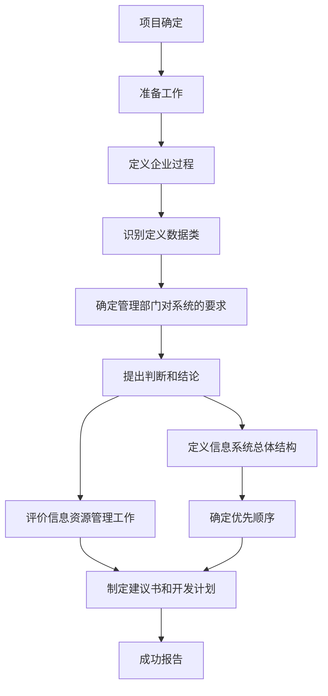

#### **典型信息系统项目特点**

>* 项目初期往往目标不太明确
>* 智力密集型
>* 需求变化频繁
>* 系统分析和设计所需人员层次高、专业强
>* 软硬件常常需要个性化定制
>* 设计的软硬件厂商和承包商多，联系、协调复杂
>* 项目生命周期通常较短
>* 通常要采用大量的新技术
>* 使用与维护的要求高
>* 项目绩效往往难以评估和量化

#### **大型信息系统项目特点**

>* 规模庞大
>* 跨地域性
>* 网络结构复杂
>* 业务种类多
>* 数据量大
>* 用户多

#### **企业系统规划**

